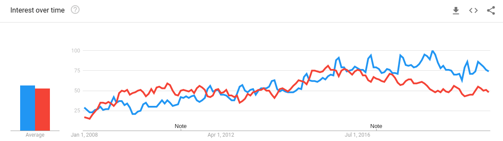
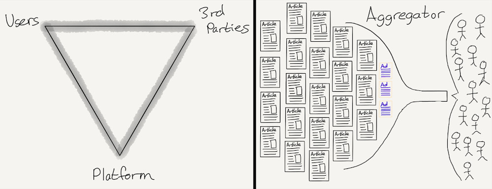
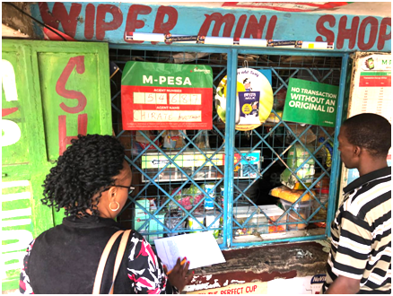
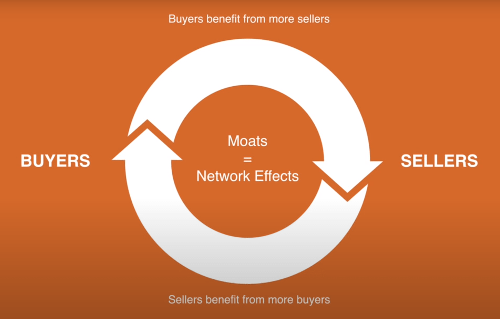

** “Gentlemen, there’s only two ways I know of to make money: bundling and
unbundling.” ** - Jim Barksdale

** The Great Unbundling: Banking **  

Safaricom unbundled the big banks in Kenya during the late 00s with mobile money
transfer service M-PESA. It's market shares stands at 99% with 40M+
customers. In this article, I will explore options for what's next for
Safaricom from a perspective of where the internet is headed.

** Success & Market Share **   Back in the days, there was a notion among
bankers that middle to low-income consumers were twopenny-halfpenny & you
couldn't make substantial money banking them. M-PESA confuted this. In 2007 the
average distance to the nearest bank was 9.2 KM (urban areas). In 2015, the
average distance to the nearest M-PESA agent was a mere 1.4 KM with 167,000
agents registered. The company IPOed in 2008 with shares at KSH 5
($0.05). Today they are worth KSH 30 ($0.3), a **6x** return with a market cap
of **\$10B** (10 times than the largest bank). With smartphone penetration at
97%, mobile transactions totaled to ** \$43.5B ** annually while Subsaharan
Africa recorded ** \$456.3B ** in 2019. It's worth pointing out however, the
M-PESA interface feels pre-internet 13 years later. The software is boring but
works. Businesses struggle with integrating the API into their modern systems.

** Internet 1.0 **   The first phase of the internet involved two things:
 

1. **Connectivity**.  
2. **Information Arbitrage**.  We are almost done connecting everyone
   online. But is every industry online? Not really. The use-case is just
   beginning. Retail is still largely informal and offline.

** Internet 2.0 **   The internet is evolving to quality & tastemaking.
Let's explore two case studies:

** 1. Google Trends**. A comparison between two search terms: 'Best' (in blue) &
'Cheap' (in red). More users are interested in finding out what is best for them
rather than the cheapest option in the market.

  

** 2. TikTok**. Specifically user retention & the speed they achieved
product-market-fit. Average user session is ~294s with each session having >100
content units. Traditional social media trails this. Twitter session is ~114s
with 50-75 content units. Tiktok has managed to attain this stickiness from
their near-perfect **recommendation algorithm**. As you use it, gives you the
impression it knows you better by the interaction. Same with Spotify. Spotify &
TikTok like many digital products serve content using recommendations in-turn
boosting the **user experience**, rendering what you **just** want to see.

** Failed Experiments? **   3 years ago (2017), Safaricom launched
[Masoko.com](https://www.masoko.com/). The model was sketchy. Safaricom acted as
a retailer but it was also opened to 3rd parties. However, they cut 3rd party
vendors in November 2019, with a new revamp site that is still
[awful](https://developers.google.com/speed/pagespeed/insights/?url=https%3A%2F%2Fwww.masoko.com%2F). 
What went wrong?   E-commerce is hard in Africa. Some facts & numbers to
back this:

-   Purchase power is low: **\$42** is the average amount consumers spend online
    annually in Kenya. Globally that amount is **\$2,594** for the same period.
-   Last-mile challenges - Cost of transporting goods in sub-Saharan countries
    is 5x (per unit distance) in some sub-Saharan African countries compared to
    the US.

Last year, the retail revenue was **\$20B**, but e-commerce has managed to
capture **\$640M**. That is **3%**. Most consumers bought Electronics & Media
(**\$430M**) more than any other product category. Copying & relying on
traditional modes to E-Commerce won't be viable for the current market, or is
it? Amazon ranks as the 13th popular site in Kenya, 2 spots ahead of Jumia.

But this doesn't mean it's impossible.

** Platforms & Aggregators**   One distinction we need to make is between
**Aggregators** and ** Platforms**. An aggregator sits between the user and
service providers. They own the user & scale the relationship. They help users &
suppliers find each other. An example is Google. Google aggregates users who
come on the site to look for information. They sell these users to relevant
advertisers. The main revenue is from advertising. A Platform from Bill Gates
quote is 'when the economic value of everybody that uses it, exceeds the value
of the company that creates it'. An example is Apple. They sell phones but they
create much greater value from the apps via the app store. It's a whole
economy.  Here is an illustration by <a href="https://stratechery.com/">Ben
Thompson</a> on the difference.

  

Platforms let their users and customers shine. My favorite analogy is
**Platforms are enablers while Aggregators are regulators**. 

** Post-mortem **  At this point, we need to answer two questions:  

1. Was/Is Masoko an aggregator or a platform?  
2. What are the alternative paths for the product?   My answer to the first
   question: an **aggregator**.  Did suppliers gain any more benefits than
   listings? Did the users get any more value than being connected to suppliers?
     Users churned to classified sites like [Jiji](https://jiji.co.ke/) &
   [PigiaMe](https://www.pigiame.co.ke/), it's far better competitors with
   superior product & catalog.

### The Marketplace  

What are the alternative paths? Let's explore the cards -- no pun intended -- in
Safaricom hands.

** Consumer Behavior **   Low-income consumers are underserved by
'traditional' e-commerce models which aim for upper-middle to elite consumers.
For consumers in sub-Saharan Africa, shopping is a daily/weekly endeavor.
Instead of large malls, the retail sector is dominated by small local shops
(‘Dukas’), line shop kiosks, table-top kiosks, market & roadside stalls
mom-and-pop shops. The quantity is low but the **frequency** is high allowing
them to maintain a close working relationship with their customers. Most of
these shops don't have any modern form of inventory management, no POS, low cash
flow, low margins, and credit needy shopkeepers.   One important feature in
these shops is the presence of an MPESA agent(s). Safaricom has managed to work
with the small local shops seamlessly when it comes to money transfer.  

  

Example of a Duka with an M-Pesa agent.

** The Opportunity: Bundling of Retail **   In the same way that the banking
experience of the middle to low-income users was improved, their shopping
experience too can. The need for an ** Online to Offline platform** is massive.
  Let's envision how this platform would look like:  

1.  3rd Party centric.  
2.  Data-Driven.  
3.  An Eco-System.

** 1. 3rd Party Centric (3P)**   This means that Safaricom acts as an
enabler, rather than a retailer. Suppliers & retailers can setup up a shop in
the platform and list their catalog. (In 2014, Amazon's margin from 3P was
** >85% ** while the 1P was **~25%**). The platform aims to drive maximum sales
value while providing all the back-office tools needed to the retailers. The
platform's revenue will be a function of Gross Merchandise Volume (GMV). The
network-effects creates a virtuous cycle, like a rolling wheel, that never ends
& is hard to escape (explained below in moats).

  

Illustration from <a href="https://a16z.com/">a16z.</a>

** 2. Data-Driven **   Good data creates better recommendation systems.
Better recommendations create the best user experience. TikTok overstates this.
Pre-Internet, customers didn't matter much. Their aggregation at scale pushed
consumers to first priority.   ** The gold mine**: Got a date tomorrow?
Safaricom knows it. Need an overdraft to sort the bill? M-PESA got you.  
Safaricom through its services has managed to control the financial,
communication & the internet markets. They are the gatekeepers. Such data is
utilitarian in retail. With users looking for the best services/products, the
platform can attain a buying decision coordination that's unmatched, retaining
users & suppliers. Data is the business, everything else is a means.

** 3. An Eco-System **   It's tough to build a platform that fulfills all
consumers/suppliers needs. An open & friendly platform where developers &
partners can build upon & integrate with the core platform is essential.
Economics should be aligned to incentivize this.  The network effects are
two sided. Developers build (micro-apps) on the platform attracting users, which
in-turn attracted developers. Again, once this wheel starts rolling, it's
extremely hard to compete with. An ecosystem is more powerful than platform
lock-ins. Apple & WeChat have perfected this.

What are the advantages and moats for such a platform?

#### Advantages

1. Network-Effects. (discussed below)
2. Capital Efficient: No need to set up warehouses & inventory, near-zero cost
   of acquiring users & suppliers since they're already captured in M-PESA.
3. Unlimited selection of products: Everything you need can be curated. Credit
   can also be provided to either the user to shop or the supplier to stock.
4. Community: With supercomputers in our pockets, most of the work will be
   offset to the community using the platform. Since it provides a win-win
   situation, everyone will work to improve the ecosystem.

#### Moats

1. Network-Effects: They create monopoly naturally. The network gets better on
   every use. Users attract users by improving the experience, users attract
   suppliers, suppliers attract users, both attract developers to build on the
   platform & the cycle repeats. The wheel never stops. It's hard to compete
   with this.
2. Supply Chain: With MPESA agents just near the corner (every 1.4KM), they can
   act as a pickup point. So can retailers.
3. Brand: The essence of a brand is knowing what to expect. Safaricom ranked 1st
   in Kenya & 10th in Africa under the top brands.
4. Data & Identity: With the ocean of data Safaricom collects, the possibilities
   are endless.

#### Final Thoughts

** "Of course, you always are bundling and unbundling. You can’t stand still..."
** - Jim Barksdale.   There is a striking paradox in the technology
business: The rich-get-richer and you get wiped out for not innovating. It's the
deadliest sin.  Safaricom's failure to scale M-PESA to 1.7 billion unbanked
people is something between social activism & communism. It hasn't captured the
maximum value. These experiments are hard to re-run. Sometimes we are
overwhelmed by our inability to do complex coordination and describe a future
that is different from the present, but we should give it a shot.

Thank you for reading.
