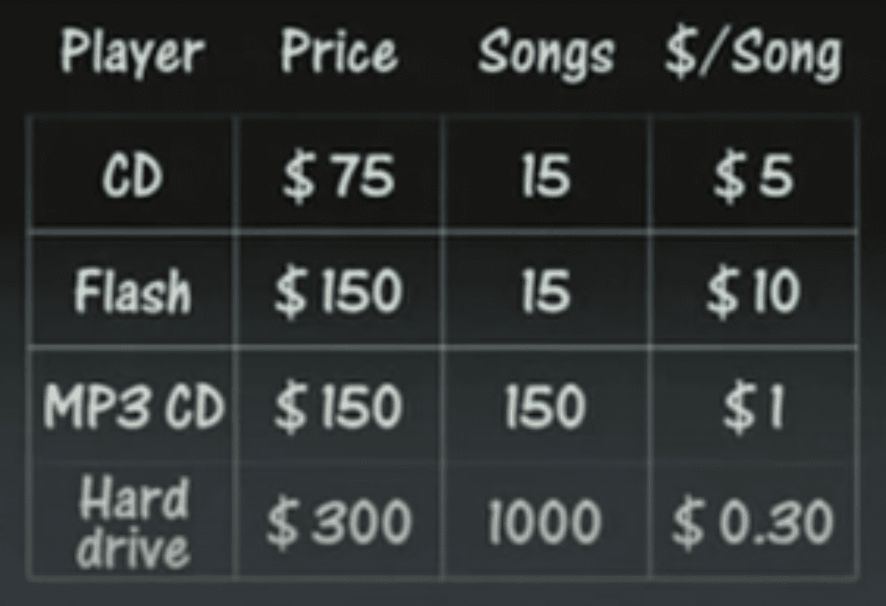
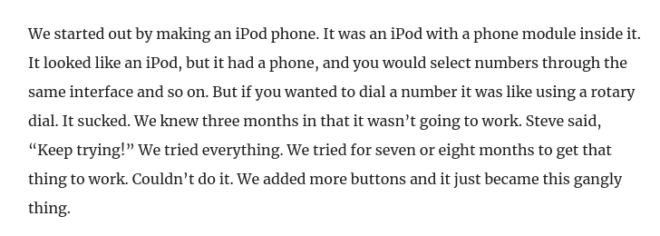

  

Humor sponsored by <a href="https://xkcd.com/356/">https://xkcd.com/356/</a>

#### TL;DR
Karlheinz Brandenburg developed the initial compression algorithm used in MP3 music format, which shrank music size by 12:1, making it faster & cheaper for music to be shared and downloaded from the internet. With no coherent business model around digital music, Apple made the iTunes & iPod that unbundled song purchase from the album. Out of fear of being disrupted, Apple built the "iPod phone" aka iPhone.

#### Backstory

In the early 90s, music consumption was largely over CDs. The audio was stored in AIFF (Audio Interchange File Format). It was high quality and excessively large. One song, 3 minutes long, could be 30 MB in size. An album, 80 minutes could be 800 MB.  
With internet speeds averaging 6.1 kbit/s, it took ~1.5 Hrs to download a song, and about ~1.5 days to get an album. A 16GB MP3 player would only hold around 20 albums.

In 1995, The Fraunhofer Society posted a shareware version of their MP3 encoding software on the internet. The software under the hood implemented a [digital music compression algorithm](https://youtu.be/KGZ0een8vSE) based on Karlheinz Brandenburg's work. Karlheinz, an electrical engineer & **mathematician**, developed mathematical models that shrank music by 10:1 to 12:1 of its original size while retaining quality. A song's size with this technology will be about 3 MB down from the 30 MB and will take ~8 minutes to download.

#### Problem

With this enabler, song sharing on the internet exploded. This broke the music's industry business model of selling physical goods. Music piracy was on the rise. Music executives & record labels began clamping down on illegal music by bringing [lawsuits](https://www.wsj.com/articles/SB1043272052918464944) against individual downloaders.

Napster, founded in 1999 & pioneered peer-to-peer sharing, enabled users to share music from their machines without connecting to a central server. It was popular, distributed, and harder to crackdown.

#### Aftermath

Steve Jobs, fresh from his return to Apple in 1997, saw the opportunity to build a business model around a legal & better product for music distribution. In 2001, Apple [introduced](https://youtu.be/kN0SVBCJqLs) the iTunes and iPod. The iPod had 1,000 songs, with $0.99 per song, unbundling song purchase from the album.

  

 Slide from iPod launch, 2001.

With music execs still kicking themselves for missing the digital music train, they couldn't pass on Jobs' offer. 

iPod was a success, selling over 400 Million units by 2015. iTunes paved the way for modern music streaming & was replaced by Apple Music.

In 2006, Apple executives worried that the iPod would lose market share once cellphone manufacturers figured out how to put MP3 players on their phones. But not if Apple beat them to it. The first concept of the iPhone was "iPod phone". Below is a [snippet](https://venturebeat.com/2016/02/28/how-the-father-of-the-ipod-iphone-and-nest-became-a-tech-visionary/) of Tony Fadell (one of the original designers of the iPod and the first three iPhones) explaining the iPhone inspiration.

  

The rest is history. 

The beauty of randomness & maths🌹.
